# Unity → Unreal 5.8: lo aprendido convirtiendo in-coming

28 de septiembre de 2026

## Resumen

El proyecto Unity **in-coming** se juega en Unreal Engine 5.8.1: el minijuego HordeDefense (escena
`claude-demo`) arranca, los enemigos atacan en oleadas, el grupo dispara, los cubos sueltan banderolas
que suman soldados, y todo tiene materiales y animaciones.

- **Punto de partida:** una sesión en la nube escribió el conversor `unity2ue` (unas 8.000 líneas) sin
  poder probarlo, porque no tenía Unreal. Sólo comprobaba que los scripts del editor no tuvieran
  errores de sintaxis.
- **Lo hecho aquí:** ejecutarlo contra un proyecto real y el motor real, corregir lo que fallaba y
  automatizar el proceso de punta a punta (convertir, compilar, importar, verificar, capturas y
  prueba de juego).
- **Resultado medible:** 54 tests automáticos en verde; importación de in-coming sin errores (143
  elementos OK); compilación completa en 4,5 min en SSD; rama `claude/unity-to-unreal-converter-nnxt49`
  del repositorio `arico19/claude-unity-to-ue8`.
- **Proyecto convertido:** `G:\unitytoue8_pruebas\InComingUE\InComing.uproject`, nivel
  `/Game/Unity/Maps/claude_demo`.

## Arquitectura del conversor

El conversor tiene tres capas: un toolkit Python que lee Unity y genera el proyecto Unreal, agentes de
Claude Code que traducen la lógica C#, y scripts Python que se ejecutan dentro del editor de Unreal para
importar el contenido.

```mermaid
flowchart TD
    A["1. Proyecto Unity (sólo lectura)<br/>escenas, prefabs, .mat, .anim, FBX, scripts C#"]
    B["2. unity2ue convert (Python, fuera de UE)<br/>JSON neutral + .uproject + esqueletos C++"]
    C["3. Agentes de Claude Code (/convertir-scripts)<br/>traducen los métodos C# a C++"]
    D["4. Compilación del módulo C++ (UE 5.8)<br/>Build.bat -NoUBA · 4,5 min en SSD"]
    E["5. Importación dentro del editor<br/>assets, animaciones, materiales, Blueprints,<br/>retarget humanoide, DataAssets, niveles, extra/"]
    F["6. Verificación y prueba de juego<br/>verify.json, capturas, Play automático"]
    O["Orquestación: app Unity2UE.pyw · convertir.bat · unity2ue full / ue"]
    A --> B --> C --> D --> E --> F
    O -.-> B
    O -.-> D
    O -.-> E
    O -.-> F
```

Los pasos 2, 4, 5 y 6 son deterministas y se repiten sin intervención; el paso 3 es el único que usa IA
y consume tokens. El código está en `H:\unitytoue8\unity2ue\` (toolkit), `ue_editor\unity2ue_import\`
(scripts del editor) y `.claude\` (agentes y skills).

## Problemas encontrados en UE 5.8 real

Probar contra el motor real destapó unos 40 fallos que la sesión en la nube no podía ver. Todos están
corregidos en el conversor salvo donde se indica.

| Área | Síntoma en Unreal | Causa | Solución |
| --- | --- | --- | --- |
| C++ generado | No compilaba (UHT) | Overrides y sobrecargas con UFUNCTION, parámetros que ocultan propiedades, delegados como parámetro, tipos sin declarar | El generador aplica las reglas de UHT e incluye los tipos de parámetros y retornos |
| Blueprints | El editor se cerraba al importar | Handle inválido tras cambiar la raíz física | Se vuelve a buscar el handle; se valida antes de añadir |
| Reimportación | Blueprints y niveles "no se pudieron crear" | Borrar y recrear un asset en la misma sesión falla | Se reutilizan vaciando sus componentes o actores |
| Fuentes | El editor se cerraba | Importar fuentes necesita la UI de Slate | Se importan en el paso con editor visible |
| Personajes | Tumbados, de lado o 100 veces más grandes | Corrección de ejes del FBX aplicada dos veces; unidades del FBX ignoradas | Force Front X Axis + Convert Scene Unit; los nodos de malla con skin no aplican su rotación |
| Enemigos | Invisibles | FBX arrastrado directamente al prefab tratado como prefab anidado; su escala 0,15 se perdía | Instancia de modelo = componente de malla con la escala de la instancia |
| Esqueletos Blender | "Varias raíces en la jerarquía ósea" | UE exige un solo hueso raíz | Blender añade un hueso `root` conservando los ejes |
| Animaciones `.anim` | No se convertían | Formato propio de Unity | Muestreo de curvas + retarget por pose de reposo leída del FBX original |
| Animaciones Mixamo | Soldado en pose de T | Unity las adapta con su Avatar Humanoid | Retarget por nombre humano de hueso (51 huesos emparejados) |
| Recompensas | Las banderolas no aparecían ni sumaban | Overrides de la escena, componentes añadidos en variantes y TextMeshPro 3D no convertidos | Los tres se convierten ahora |
| Materiales | Todo gris cuadriculado | El material maestro no compilaba en SM5; faltaba "Used with Skeletal Mesh" | Textura blanca lineal propia y usos activados |
| Sprites | No se veían o salían gigantes | Requerían Paper2D; `m_Size` guardaba un valor viejo | Plano translúcido con tamaño = píxeles / PixelsPerUnit |
| Entrada | Disparo continuo; grupo atascado a la izquierda | La UI se quedaba con la suelta del botón del ratón | Modo de entrada sólo juego (cambio en el C++ de in-coming) |
| Escena | Una esfera junto al soldado | DefaultPawn de UE | `UnityGameMode` sin pawn; la cámara de Unity es la vista |

## Lecciones del entorno (este PC)

El mayor retraso no fue el conversor sino dónde estaba el proyecto: en H: (disco USB mecánico) una
compilación tardaba 47 min; en G: (SSD) tarda 4,5 min.

| Tema | Qué pasa | Qué hacer |
| --- | --- | --- |
| Disco del proyecto UE | El precompilado (PCH) de 2,5 GB se lee a trozos; en USB el compilador parece colgado | Proyectos UE siempre en SSD (G: o D:). La app avisa si el destino es USB o HDD |
| DirectX 12 | La GTX 1070 se cuelga (`DXGI_ERROR_DEVICE_REMOVED`) | DX11 forzado para todos los proyectos en `%LOCALAPPDATA%\Unreal Engine\Engine\Config\UserEngine.ini`; el conversor genera DX11 |
| Memoria (16 GB) | Editor + compilación + Chrome llegaron a agotarla | Cerrar programas pesados antes de compilar; ir por pasos (`--steps`) |
| Editor abierto | Importar o compilar con el editor abierto bloquea ficheros | Cerrar el editor antes de reimportar o compilar |
| Epic Games Launcher | Consumía CPU en segundo plano | Cerrarlo si no hace falta |
| Prueba sin intervención | Hacía falta ver el juego funcionando | Paso `play`: pulsa Play, hace capturas, vuelca los actores y acepta comandos (`unity2ue.AutoMove`, `unity2ue.AutoFire`) |

## Qué se puede reutilizar

Casi todo: las correcciones se hicieron en el conversor, no a mano en el proyecto, así que cualquier
proyecto Unity nuevo las recibe. Lo específico de in-coming está aislado en su carpeta `extra/` y en su
C++ traducido.

| Pieza | Reutilizable | Dónde |
| --- | --- | --- |
| Conversor completo (escenas, prefabs, variantes, overrides, materiales, sprites, textos 3D, DataAssets) | Sí, cualquier proyecto Unity | `H:\unitytoue8\unity2ue\` |
| Animaciones `.anim` y retarget Humanoid | Sí | `convert\anim_clips.py`, `convert\humanoid.py`, `ue_editor\...\anim_retarget.py` |
| Lector de FBX binario | Sí, también fuera del conversor | `unity\fbx.py` |
| Corrección de esqueletos con Blender | Sí (necesita Blender instalado) | `ue_editor\...\blender_fix_root.py` |
| Automatización (compilar, importar, verificar, capturas, Play) | Sí | `ue_runner.py`, `convertir.bat`, app `Unity2UE.pyw` |
| Capa de compatibilidad Unity en C++ (`Instantiate`, `GetComponent`, `UnityGameMode`...) | Sí, se copia a cada proyecto | `ue\templates\UnityCompat\` |
| Retoques por proyecto (paso `extra`) | El mecanismo sí; el contenido es de in-coming | `Content\Python\unity2ue_import\extra\` del proyecto UE |
| Generador de texturas (tablones, caja, metal) | Sí como punto de partida | `Unity2UE\custom_textures\make_textures.py` de in-coming |
| C++ traducido de in-coming | Como referencia de estilo, no directamente | `G:\unitytoue8_pruebas\InComingUE\Source\` |
| Cambios de diseño (todos los soldados disparan) | No, son de este juego | `PlayerShooter.cpp` de in-coming |

La memoria de Claude Code de esta carpeta guarda el estado del proyecto, las lecciones del entorno y el
plan de la herramienta para cambiar personajes, así que otra sesión puede retomar donde se dejó.

## Pendientes

- [ ] Herramienta para cambiar los stickmen y el personaje del jugador por otros modelos (a la espera
      de instrucciones; el retarget Humanoid ya hecho sirve de base)
- [ ] Dimensiones del carril: el grupo puede salirse de la pasarela de 6 m (en Unity pasa igual)
- [ ] El fusil flota: hay que engancharlo al hueso de la mano
- [ ] Convertir la interfaz uGUI (botón de empezar, marcador) a UMG
- [ ] Probar la app de Windows de principio a fin con otro proyecto Unity
